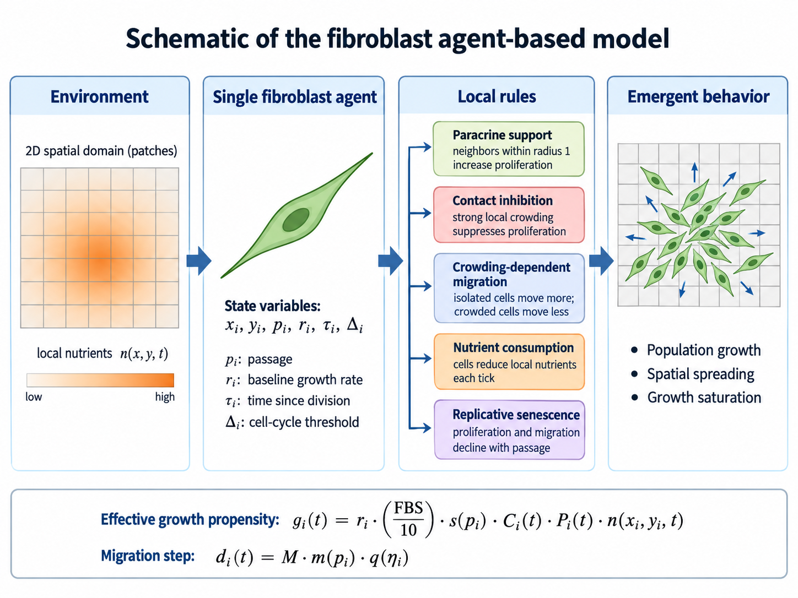

# Fibroblast ABM

**Spatial Agent-Based Modeling of Fibroblast Proliferation and Migration**

*A stochastic, spatial NetLogo model for linking fibroblast cell-cycle dynamics, migration, local interactions, nutrient availability, and replicative senescence to emergent population growth.*

A spatial agent-based model (ABM) of human gingival fibroblast proliferation and migration implemented in NetLogo.

The model represents individual fibroblasts as autonomous agents moving in a two-dimensional domain. Proliferation emerges from treatment-specific baseline proliferative capacity, serum availability, replicative age, short-range contact inhibition, longer-range paracrine support, local nutrient availability, stochastic cell-cycle timing, and spatial constraints. Migration is represented as a random walk modulated by replicative passage and local crowding.


## Model schematic



The model links a patch-level nutrient environment to individual fibroblast agents and local interaction rules. Cells move by a random walk, consume local nutrients, receive paracrine support from nearby cells, experience short-range contact inhibition, and progressively lose proliferative and migratory capacity with replicative passage. Local crowding also reduces attempted migration. These cell-level rules generate population growth, spatial spreading, and apparent saturation without imposing a population-level logistic growth equation. A detailed explanation and manuscript-ready caption are provided in [`docs/MODEL_SCHEMATIC.md`](docs/MODEL_SCHEMATIC.md).

## Suggested GitHub metadata

**Repository name:** `fibroblast-abm`  
**GitHub description:** Spatial NetLogo agent-based model of human gingival fibroblast proliferation and migration, including stochastic cell-cycle timing, senescence, contact inhibition, paracrine support, nutrient depletion, and crowding-dependent motility.

Suggested repository topics and release text are provided in [`GITHUB_METADATA.md`](GITHUB_METADATA.md).

## Repository contents

- `model/Fibroblast_ABM.nls` — complete NetLogo source code.
- `assets/model_schematic.png` — schematic overview of the ABM for the README and manuscript.
- `docs/MODEL_DESCRIPTION.md` — manuscript-oriented model description and equations.
- `docs/MODEL_SCHEMATIC.md` — detailed explanation and manuscript-ready caption for the schematic.
- `docs/PARAMETERS.md` — detailed definition of all model variables and parameters.
- `docs/INTERFACE_SETUP.md` — NetLogo Interface widgets required to run the model.
- `analysis/logistic_analysis.py` — Python script for fitting logistic curves to migration-screen outputs.
- `data/` — location for simulation output files; raw/generated data are not committed by default.
- `CITATION.cff` — citation metadata template.
- `LICENSE` — MIT License.

## NetLogo requirements

The source code is provided as an `.nls` file so that it can be inspected and version-controlled cleanly. To run it:

1. Open NetLogo.
2. Create a new model.
3. Copy the contents of `model/Fibroblast_ABM.nls` into the Code tab.
4. Create the Interface widgets described in `docs/INTERFACE_SETUP.md`.
5. Click `setup`, then repeatedly click `go`, or run one of the screening procedures.

The model assumes that the Interface defines the variables `FBS`, `migration`, `initial-passage`, `initial-cell-density`, and `treatment`. These variables must **not** also be declared in `globals`, because NetLogo Interface variables are global automatically.

## Time and spatial calibration

One simulation tick is interpreted as **1 hour**.

The current analysis convention maps one NetLogo patch to **20 µm**, so a migration parameter of `1.0` corresponds to a nominal displacement of 20 µm/h before passage-dependent, crowding-dependent, boundary, and collision constraints are applied.

## Biological treatments

The current treatment-specific baseline proliferation parameters are:

| Treatment | `base-growth-rate` |
|---|---:|
| Control | 0.0593 |
| Polynucleotides | 0.0629 |
| Newest | 0.0579 |
| Newest_half | 0.0503 |
| HA | 0.0672 |

These values are individual-cell baseline proliferation propensities. They should not be interpreted as identical to a population-level logistic growth-rate parameter fitted to simulation output.

## Core proliferation rule

For proliferation-eligible cell \(i\), the model uses the effective growth propensity

\[
g_i(t)=r_i\left(\frac{FBS}{10}\right)s(p_i(t))C_i(t)P_i(t)n(x_i(t),y_i(t),t),
\]

where \(r_i\) is the treatment-specific baseline proliferation parameter, \(s\) is the passage-dependent senescence factor, \(C_i\) is contact inhibition, \(P_i\) is paracrine support, and \(n\) is local nutrient availability.

A cell becomes eligible for division only after its individual stochastic threshold \(\Delta_i\) is reached. Thresholds are sampled from a normal distribution with mean 24 h and standard deviation 5 h, with a lower bound of 1 h. Once eligible, division is tested hourly as a Bernoulli event with probability \(g_i(t)\).

## Migration rule

The attempted displacement per hour is

\[
d_i(t)=M\,m(p_i(t))\,q(\eta_i(t)),
\]

where \(M\) is the baseline migration setting, \(m(p_i)\) is the passage-dependent motility factor, and \(q(\eta_i)\) is the crowding-dependent migration factor based on the number of nearby cells.

Movement direction is random. A move is rejected if the final position is within 0.1 patches of another cell. Domain boundaries are clamped rather than reflective.

## Important modeling note: FBS enters twice

In the current implementation, FBS affects proliferation directly through `FBS / 10` and also determines the initial patch nutrient level through

```netlogo
set nutrients (FBS / 10)
```

Thus, at simulation initialization, FBS contributes approximately quadratically to the effective proliferation propensity. This can be interpreted as separate serum mitogenic and resource-availability effects, but it should be retained only if that dual biological interpretation is intended.

## Output screens

`screen-by-FBS` writes:

```text
FBS,tick,cell_count
```

`screen-by-migration` writes:

```text
migration,tick,cell_count
```

Both outputs are CSV files that can be analyzed using the Python script in `analysis/`.

## Reproducibility

The model is stochastic. For reproducible runs, set a NetLogo random seed before `setup`, for example:

```netlogo
random-seed 12345
setup
```

For publication-quality results, use multiple independent stochastic replicates per parameter combination rather than relying on a single run.

## Citation

Please edit `CITATION.cff` with the final author list, title, repository URL, DOI, and publication details before release.

## License

MIT License. See `LICENSE`.
